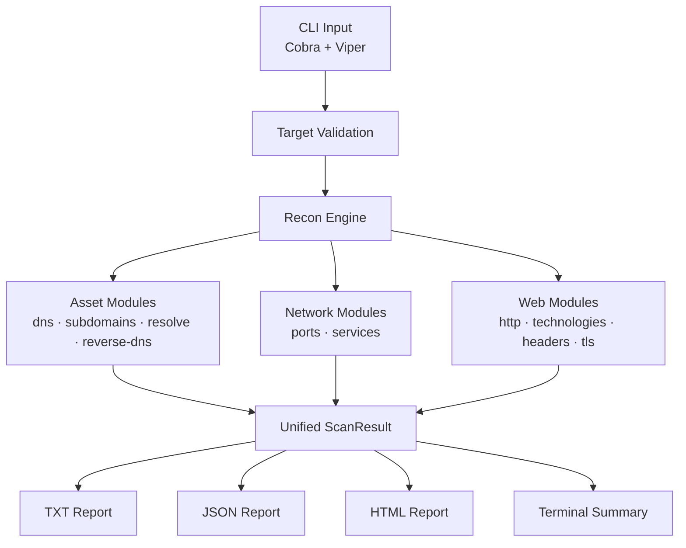
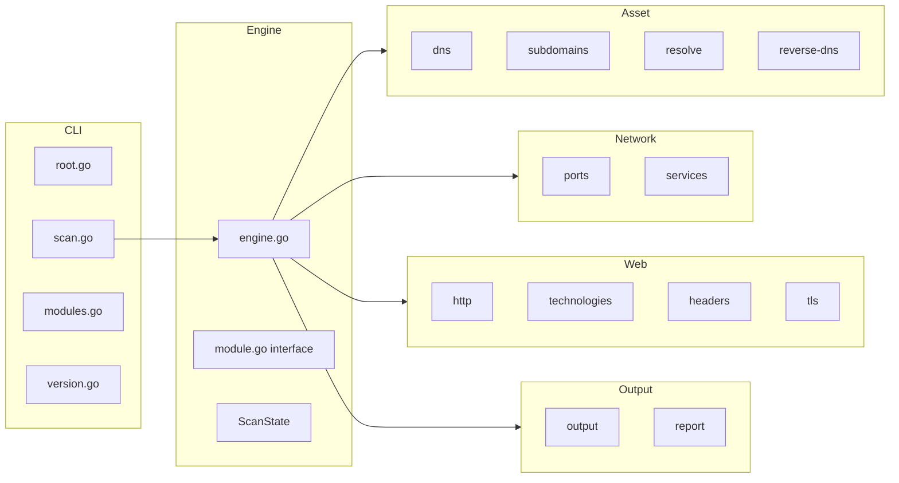

# Zrecon — Academic Project Report

**Advanced Reconnaissance & Enumeration Framework**

- **Author:** Ziad
- **Version:** 1.0.0
- **Language:** Go
- **Date:** 2026

---

## 1. General Introduction

Information gathering is the first and most critical phase of any penetration testing engagement. Before vulnerabilities can be identified or exploited, a security tester must build a comprehensive map of the target's attack surface: what domains and subdomains exist, which IP addresses host them, which network ports are open, what services are running, and what web technologies are in use.

Manual reconnaissance is slow, error-prone, and difficult to reproduce. Automated tooling is standard practice in the industry, but most existing tools are either too narrowly focused (performing only one task), too heavyweight (requiring complex infrastructure), or not designed with academic clarity in mind.

Zrecon addresses this gap by providing a single, self-contained CLI tool that automates the four main reconnaissance axes — asset discovery, network discovery, web discovery, and reporting — in a clean, modular, and educationally transparent codebase.

---

## 2. Project Context

This project was developed as part of an academic curriculum in cybersecurity engineering. It serves as a practical implementation of theoretical concepts taught in network security, web security, and penetration testing courses.

The tool is designed to be used only in authorized contexts:
- Security laboratory environments with dedicated test machines
- Bug bounty targets within explicit program scope
- Systems owned by the user
- Academic research with ethical approval

---

## 3. Problem Statement

Penetration testers performing reconnaissance face the following challenges:

1. **Fragmented tooling** — Different tools for DNS, subdomains, ports, web, and reporting with no unified output
2. **No data correlation** — Results from individual tools are not linked (e.g., subdomain → IP → port → web service)
3. **Missing safety controls** — Tools often have no built-in authorization enforcement
4. **Poor reporting** — Raw output files with no structured or human-readable summary
5. **Complex dependencies** — Tools that require external services, databases, or Nmap

Zrecon solves all five by providing a modular Go binary with a unified data model, built-in authorization controls, and automatic report generation in TXT, JSON, and HTML formats.

---

## 4. Project Objectives

**Primary:**
- Automate reconnaissance across four axes: asset, network, web, and reporting
- Produce a unified, correlated scan result
- Generate professional reports in multiple formats
- Enforce authorization requirements for active modules

**Secondary:**
- Remain lightweight (single binary, no external database)
- Support Linux with portability to Windows and macOS
- Provide clean, well-structured Go code for academic study
- Include unit tests and a race-condition-free concurrency model

---

## 5. Functional Requirements

| ID | Requirement |
|---|---|
| FR-01 | Accept domain, URL, IPv4, or target file as input |
| FR-02 | Enumerate DNS records (A, AAAA, CNAME, MX, NS, TXT, SOA, CAA) |
| FR-03 | Discover subdomains via Certificate Transparency |
| FR-04 | Resolve subdomains to IP addresses |
| FR-05 | Detect wildcard DNS configurations |
| FR-06 | Perform reverse DNS (PTR) lookups |
| FR-07 | Scan TCP ports (top-20, top-100, custom) |
| FR-08 | Detect services via banner grabbing |
| FR-09 | Probe HTTP/HTTPS endpoints |
| FR-10 | Extract page titles and redirect chains |
| FR-11 | Detect web technologies from headers, cookies, HTML |
| FR-12 | Analyze security headers |
| FR-13 | Collect TLS certificate metadata |
| FR-14 | Correlate all findings into a unified result model |
| FR-15 | Generate TXT, JSON, and HTML reports |
| FR-16 | Require --authorized flag for active modules |
| FR-17 | Support Ctrl+C graceful interruption |
| FR-18 | Support --passive, --all, and --modules flags |

---

## 6. Non-Functional Requirements

| ID | Requirement |
|---|---|
| NFR-01 | Single binary with no runtime dependencies |
| NFR-02 | Compile and run on Linux (Go 1.23+) |
| NFR-03 | No race conditions (verified with `go test -race`) |
| NFR-04 | Configurable concurrency (default: 20 threads) |
| NFR-05 | Configurable rate limiting (default: 50 req/s) |
| NFR-06 | Configurable timeouts (default: 10 seconds) |
| NFR-07 | HTML report must be offline-capable (no external CDN) |
| NFR-08 | All untrusted data must be HTML-escaped in reports |
| NFR-09 | One module failure must not crash the scan |

---

## 7. Proposed Architecture



### Component Diagram



---

## 8. Technology Choices

| Technology | Choice | Reason |
|---|---|---|
| Language | Go 1.23 | Performance, static binary, strong concurrency primitives |
| CLI framework | Cobra | Industry standard, subcommand support, flag parsing |
| Configuration | Viper | YAML config with env variable override |
| Colors | fatih/color | Simple terminal color library |
| HTML parsing | goquery | jQuery-like API for title/tech extraction |
| DNS | miekg/dns | Low-level DNS library for all record types |
| Rate limiting | golang.org/x/time/rate | Token bucket rate limiter |
| Logging | log/slog (stdlib) | Structured logging, no external dependency |
| Testing | Go testing package | Standard, no extra dependency |

---

## 9. Reconnaissance Modules

### 9.1 DNS Module (Passive)

Queries eight DNS record types using three public resolvers (8.8.8.8, 1.1.1.1, 8.8.4.4) with automatic failover. Results are stored in the `DNSRecord` model with name, type, value, and TTL.

### 9.2 Subdomain Discovery (Passive)

Queries two public Certificate Transparency sources:
- **crt.sh** — Searches the `%.domain` pattern via the JSON API
- **HackerTarget** — Uses the hostsearch API

Results are normalized: wildcards stripped, duplicates removed, non-matching domains filtered, sources tracked.

### 9.3 Resolution Module (Active)

Resolves discovered subdomains using Go's standard `net.LookupHost`. Performs wildcard DNS detection by querying a random subdomain first. Resolved IPs are deduplicated into the `IPAddress` list. CNAME chains are followed via `net.LookupCNAME`.

### 9.4 Reverse DNS (Passive)

Performs PTR lookups via `net.LookupAddr` for all collected IP addresses, including those from the root target.

### 9.5 Port Scanner (Active)

Uses TCP connect scanning (`net.DialTimeout`) — no raw sockets, no SYN packets. Supports top-20, top-100, custom port lists, and port ranges (`22,80,8000-8100`). A worker pool with a token bucket rate limiter controls concurrency and request rate.

### 9.6 Service Detection (Active)

Combines port-to-service name mapping with banner grabbing. Sends appropriate probes for HTTP, SSH, and greeting-based protocols. Enriches results from banner content (product, version, confidence).

### 9.7 HTTP Probing (Active)

Probes known HTTP/HTTPS ports (80, 443, 8080, 8443, etc.). Follows up to 5 redirects and records the final URL. Extracts page titles via goquery. Records server header, X-Powered-By, status code, content type, content length, and response time.

### 9.8 Technology Detection (Active)

Matches HTTP response headers, cookies, body patterns, and meta generator tags against a built-in signature database covering 17 technologies (web servers, CMS, frameworks, JavaScript libraries, CDNs).

### 9.9 Security Headers (Active)

Checks for 7 security headers per OWASP recommendations. Does not classify missing headers as confirmed vulnerabilities — uses conservative labels: present, missing, potential-hardening-issue, manual validation required.

### 9.10 TLS Collection (Active)

Connects using `crypto/tls` with `InsecureSkipVerify` to collect certificate metadata without requiring a valid chain. Records subject, issuer, validity period, DNS names, TLS version, and expiry status.

---

## 10. Implementation

### 10.1 Module Interface

Every module implements:

```go
type Module interface {
    Name() string
    Description() string
    Category() string
    IsPassive() bool
    RequiresAuthorization() bool
    Run(ctx context.Context, target models.Target, state *ScanState) error
}
```

The engine iterates modules sequentially, checking authorization before each active module. Module failures are recorded and do not stop subsequent modules.

### 10.2 Unified Data Model

The `ScanResult` struct is the central aggregation point:

```go
type ScanResult struct {
    Target          Target
    DNSRecords      []DNSRecord
    Subdomains      []Subdomain
    IPAddresses     []IPAddress
    Ports           []Port
    Services        []Service
    HTTPServices    []HTTPService
    Technologies    []Technology
    SecurityHeaders []SecurityHeader
    Certificates    []Certificate
    ModuleResults   []ModuleResult
    StartedAt       time.Time
    CompletedAt     time.Time
}
```

### 10.3 Concurrency Model

- Worker pools (goroutines + channels) for port scanning and subdomain resolution
- `sync.Mutex` protects shared state during concurrent writes
- `context.Context` propagated through all module calls for cancellation
- `golang.org/x/time/rate` token bucket for rate limiting

### 10.4 Output Pipeline

After all modules complete, three report formats are generated:
1. `WriteTXT` — Plain text summary and per-module files
2. `WriteJSON` — Full `ScanResult` serialized with `encoding/json`
3. `WriteHTML` — Standalone HTML using Go's `html/template` with XSS-safe escaping

---

## 11. Security and Authorization Controls

| Control | Implementation |
|---|---|
| Active modules blocked without --authorized | Engine checks `cfg.Authorized` before running non-passive modules |
| Private IPs rejected by default | `isPrivateIP()` checks RFC-1918 and loopback ranges |
| No exploitation features | Not implemented — outside project scope |
| No brute force | Not implemented — outside project scope |
| HTML output XSS-safe | All user data passed through `html/template` auto-escaping |
| Rate limiting | Token bucket limiter applied to port scanning |
| Graceful interruption | `os.Signal` → `context.Cancel()` saves partial results |

---

## 12. Testing Strategy

| Test Type | Coverage |
|---|---|
| Domain validation | Valid/invalid/uppercase/slash/IP-as-domain |
| IP validation | Public/private/loopback/IPv6/malformed |
| URL validation | http/https/auto-prepend/missing-host |
| Auto-detection | domain/ip/url routing |
| Port spec parsing | Single/list/range/dedup/invalid |
| Model integrity | DNS record/Subdomain/Port/ScanResult construction |
| JSON output | Serialize and deserialize round-trip |
| TXT output | File creation and content |
| HTML output | File creation, size check, content presence |
| Output directory | Creation and path structure |
| Race detector | `go test -race ./...` — no data races |

---

## 13. Results

The following commands produce real, working output:

```bash
./bin/zrecon --help             # displays help
./bin/zrecon version            # shows version and author
./bin/zrecon modules            # lists 11 modules
./bin/zrecon scan -d example.com --passive   # passive scan
./bin/zrecon scan -d example.com -m dns,subdomains  # selective
```

A passive scan of a real domain produces:
- DNS records in all 8 types queried
- Subdomains from Certificate Transparency logs
- TXT, JSON, and HTML reports in `results/<domain>/<timestamp>/`

---

## 14. Limitations

1. **Subdomain coverage** depends on public Certificate Transparency logs — private or recently created subdomains may not appear
2. **Service detection** is signature-based — application versions may not be precisely identified
3. **Technology detection** covers 17 technologies — many others are not fingerprinted
4. **IPv6** is not supported for port scanning
5. **No vulnerability assessment** — Zrecon identifies the attack surface only; it does not test for weaknesses
6. **No authentication** — HTTP probing does not send credentials to access protected pages
7. **Rate limiting** applies only to port scanning — HTTP requests may need manual throttling for large target sets

---

## 15. Future Improvements

| Feature | Priority | Version |
|---|---|---|
| Screenshot capture of web services | High | v2 |
| SQLite scan history and diff | Medium | v2 |
| Subdomain brute force (wordlist) | Medium | v2 |
| JavaScript secret scanning | Medium | v2 |
| Nuclei template integration | Low | v3 |
| CIDR range targeting | Medium | v2 |
| Docker container | Low | v2 |
| Scan resume (save/load state) | Medium | v2 |
| IPv6 support | Low | v3 |
| Expanded technology signatures | High | v2 |

---

## 16. Conclusion

Zrecon successfully implements a complete, working lightweight reconnaissance framework in Go. It achieves its primary objectives:

- Four reconnaissance axes implemented with 10 working modules
- Unified data model with full result correlation
- Three output formats (TXT, JSON, HTML)
- Built-in authorization controls
- Race-condition-free concurrent architecture
- 22 passing unit tests
- Single binary, no external runtime dependencies
- Professional CLI with Cobra and colored terminal output

The project demonstrates practical application of Go's concurrency primitives, interface-driven module design, and security-conscious engineering practices including rate limiting, input validation, output escaping, and safe defaults.

---

*Zrecon v1.0.0 — Academic Project — Author: Ziad*
